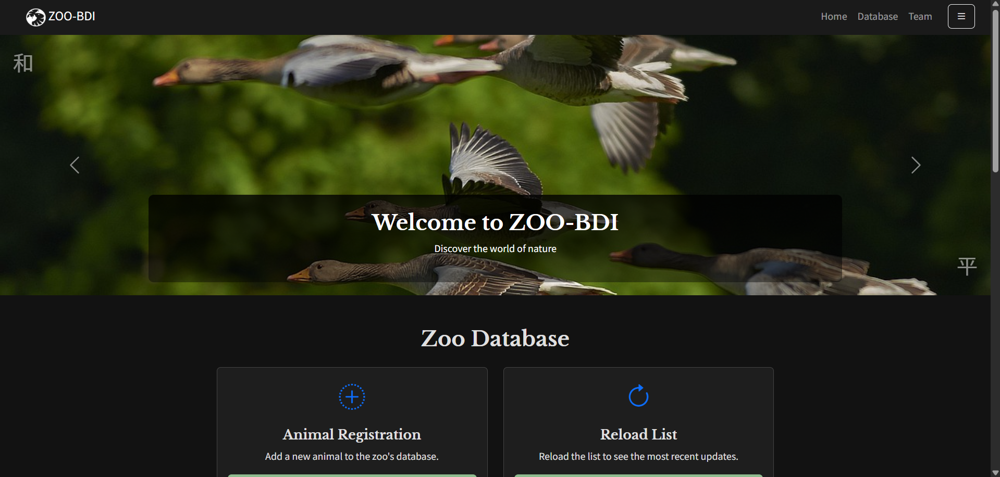
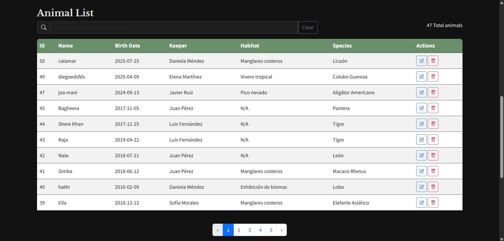

# 🦁 BDI-GB-ZOO – Sistema de Gestión de Zoológico

**Proyecto de Base de Datos I**  
**Autores:** Anderson González, Mateo Orduz, Kevin Madrid  
**Repositorio:** [GitHub](https://github.com/Albonire/BDI-GB-ZOO)  
**Creado:** Octubre 2024  
**Última actualización:** Junio 2024

---

## Descripción

Este proyecto implementa un sistema completo para la gestión de un zoológico, abarcando desde la administración de animales, hábitats, especies y cuidadores, hasta la consulta y manipulación de datos mediante una API RESTful y una interfaz web moderna.  
Incluye scripts SQL, modelos de datos, automatización, pruebas y un frontend responsivo con soporte para modo oscuro y traducción dinámica.

---

## Capturas de pantalla

### Inicio



### Lista de animales



---

## Tecnologías principales

- **Backend:** Python, FastAPI, SQLAlchemy, Pydantic, PostgreSQL
- **Frontend:** HTML5, CSS3, Bootstrap 5, JavaScript (ES6)
- **Automatización y scripts:** Bash, SQL
- **Otros:** Alembic (migraciones), Docker (opcional)

---

## Estructura del Proyecto

```
BDI-GB-ZOO/
│
├── backend/           # API REST, lógica de negocio y modelos
│   ├── src/app/
│   │   ├── routers/   # Endpoints (animales, cuidadores, hábitats, especies)
│   │   ├── models/    # Modelos ORM SQLAlchemy
│   │   ├── schemas/   # Esquemas Pydantic (validación y serialización)
│   │   ├── services/  # Lógica de negocio
│   │   └── database/  # Configuración y conexión BD
│   ├── requirements.txt
│   └── alembic/       # Migraciones de base de datos
│
├── frontend/          # Interfaz web
│   ├── ini.html       # Página principal (SPA)
│   ├── js/            # Lógica JS (animales.js, etc.)
│   └── img/           # Imágenes del equipo y logotipo
│
├── Scripts/           # SQL y automatización
│   ├── ddl/           # Definición de estructura
│   ├── dml/           # Datos de ejemplo
│   ├── select/        # Consultas de validación
│   └── scripts_auto/  # Automatización de carga y backup
│
├── data/              # Backups y datos de ejemplo
├── docs/              # Documentación y diagramas
├── models/            # Modelos ERD, LDM, PDM
└── README.md
```

---

## Instalación y ejecución

### 1. Backend (FastAPI)

```bash
cd backend
python -m venv venv
source venv/bin/activate  # o .\\venv\\Scripts\\activate en Windows
pip install -r requirements.txt
# Configura tu base de datos PostgreSQL y variables de entorno
uvicorn src.app.main:app --reload
```

### 2. Frontend

Abre `frontend/ini.html` directamente en tu navegador.  
Asegúrate de que el backend esté corriendo en `http://localhost:8000`.

---

## Principales funcionalidades

- **Gestión de animales:** Alta, baja, modificación y consulta paginada.
- **Gestión de cuidadores, hábitats y especies:** Consulta y asignación.
- **Validaciones visuales:** Campos obligatorios claramente marcados y validados.
- **Modo oscuro y traducción dinámica** (español/inglés).
- **Contador de resultados y paginación.**
- **Accesibilidad y usabilidad mejoradas.**

---

## Endpoints principales (API REST)

### Animales

| Método | Endpoint                | Descripción                        | Body/Params                  |
|--------|-------------------------|------------------------------------|------------------------------|
| GET    | `/animales`             | Listar animales paginados          | `page`, `page_size`          |
| POST   | `/animales`             | Registrar nuevo animal             | JSON: nombre, fechas, ids    |
| PUT    | `/animales/{id}`        | Actualizar animal                  | JSON: nombre, fechas, ids    |
| DELETE | `/animales/{id}`        | Eliminar animal                    |                              |

### Cuidadores

| Método | Endpoint                | Descripción                        |
|--------|-------------------------|------------------------------------|
| GET    | `/cuidadores`           | Listar cuidadores                  |
| GET    | `/cuidadores/{id}`      | Obtener cuidador por ID            |
| POST   | `/cuidadores`           | Crear cuidador                     |
| PUT    | `/cuidadores/{id}`      | Actualizar cuidador                |
| DELETE | `/cuidadores/{id}`      | Eliminar cuidador                  |

### Hábitats y Especies

| Método | Endpoint                | Descripción                        |
|--------|-------------------------|------------------------------------|
| GET    | `/habitats`             | Listar hábitats                    |
| GET    | `/especies`             | Listar especies                    |

---

## Ejemplo de request/response

**Registrar animal (POST /animales):**
```json
{
  "nombre": "León",
  "fecha_nacimiento": "2020-05-01",
  "cuidador_id": 1,
  "habitat_id": 2,
  "especie_id": 3
}
```

**Respuesta:**
```json
{
  "id": 10,
  "nombre": "León",
  "fecha_nacimiento": "2020-05-01",
  "cuidador_id": 1,
  "habitat_id": 2,
  "especie_id": 3
}
```

---

## Validaciones y buenas prácticas

- **Campos obligatorios** marcados visualmente y validados en frontend y backend.
- **Integridad referencial**: no se pueden asignar IDs inexistentes.
- **Mensajes de error claros** y accesibles.
- **Accesibilidad**: formularios compatibles con lectores de pantalla.
- **Seguridad**: uso de Pydantic, SQLAlchemy y validaciones estrictas.

---

## Créditos y equipo

- **Anderson González** – Product Owner & Developer ([GitHub](https://github.com/Albonire))
- **Mateo Orduz** – Scrum Master ([GitHub](https://github.com/mateo739))
- **Kevin Madrid** – Development Team ([GitHub](https://github.com/Kevin698-star))

---

## Contribuciones

Las contribuciones son bienvenidas.  
Por favor, abre un *issue* o crea un *pull request* con tus sugerencias.

---

